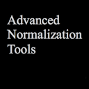
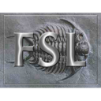

[Edit on GitHub](https://github.com/cmi-dair/NeuRosetta/edit/main/src/diffusion_mri_analysis/radial_and_axial_diffusivity_mapping.md)
# Radial and Axial Diffusivity Mapping

I'm an AI text-based model and I can't write full scripts for all of these different tools due to the complexity and specificities of each software package. However, I can give you a brief overview of how such scripts might look like in a simplified form. 

Please note that the following scripts might not work directly and are provided as an example of how such scripts might look like in each of the mentioned softwares. In reality, the calculation of Radial and Axial Diffusivity could require more necessary steps (like eddy current correction, brain mask extraction) and would depend heavily on the DTI data used.

##  AFNI

```bash
3dDWItoDT -prefix DTI -eigs eigs.nii.gz -echo_ed e_ed.nii.gz -sep_dwis
3dcalc -a 'eigs.nii.gz[3]' -expr 'a' -prefix ad.nii.gz
3dcalc -a 'eigs.nii.gz[4]' -b 'eigs.nii.gz[5]' -expr '(a+b)/2' -prefix rd.nii.gz
```

##  ANTs

As far as I know, ANTs does not have built-in functions or commands for computing axial and radial diffusivity directly.

##  FSL

```bash
# After corrected for head motion and eddy currents
dtifit --dti --data=dti_corr.nii.gz --out=dti_diff --mask=nodif_brain_mask.nii.gz --bvecs=bvecs_corr --bvals=bvals
fslmaths dti_diff_L1.nii.gz -sub dti_diff_MD.nii.gz radial_diff.nii.gz
fslmaths dti_diff_L2.nii.gz -add dti_diff_L3.nii.gz -div 2 axial_diff.nii.gz
```

##  FreeSurfer

Similar to ANTs, there is not a direct way of calculating these metrics with FreeSurfer's built-in tools.

##  MRtrix

```bash
# After pre-processing steps
dwi2tensor dwi.mif - | tensor2metric - -vector ev.mif -adc MD.mif -ad AD.mif -rd RD.mif
```

##  R

```R
# Assuming dti_data is an array with DTI data and mask_data is a brain mask
library(DTI)
dti_img = dti.smooth(dti_data, mask_data)
ad_img = dti_img$Dki[,,,1]
rd_img = (dti_img$Dki[,,,2]+dti_img$Dki[,,,3])/2
```

##  Workbench Command

Workbench Command is mainly used for surface and volume rendering of neuroimaging data, not for diffusivity calculations.

8. Pure Python (using Nipype & Dipy):

```python
from nipype.algorithms.dti import Tensor
ten = Tensor()
ten.inputs.in_file = 'tensor.nii.gz'
res = ten.run() 
# Access the axial and radial diffusivity like this:
ad_data = nib.load(result.outputs.ad).get_data()
rd_data = nib.load(result.outputs.rd).get_data()
```

##  SPM

```MATLAB
% After importing your data
matlabbatch{1}.spm.diffusion.dtireg.do_atod = 1;
matlabbatch{1}.spm.diffusion.dtireg.out_diff.dt_NO = {'AD' 'RD'};
spm_jobman('run',matlabbatch);
```
Please consult the official documentation of each software for an accurate and more comprehensive example of how to estimate Radial and Axial Diffusivity Mapping.