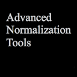
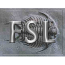

# Region-of-Interest (ROI) Analysis

here are minimal examples of scripts for Region-of-Interest (ROI) Analysis in the respective software packages. Please make sure that appropriate data sets and data paths are provided while running these scripts.

##  AFNI

```bash
3dROIstats -mask ROI.nii -quiet epi.nii > roistats.txt
```

##  ANTs

```python
from nipype.interfaces.ants import MeasureImageSimilarity
similarity = MeasureImageSimilarity()

similarity.inputs.metric = 'CC'
similarity.inputs.fixed_image = 'fixed_image.nii'
similarity.inputs.moving_image = 'moving_image.nii'
similarity.inputs.radius_or_number_of_bins = 4
similarity.run()
```

##  FSL

```bash
fslstats input_image.nii.gz -l 500 -u 600 -V > output.txt
```

##  FreeSurfer

```bash
mri_segstats --seg seg.nii --i scalar_map.nii --avgwf avg_roi_values.txt
```

##  MRtrix

```bash
mrstats input_image.mif -mask roi.mif -output mean > roistats.txt
```

##  R

```R
library(neurobase)
vol <- readnii("image.nii")
roi <- readnii("mask.nii")

roi_stats <- vol[roi==1]
mean(roi_stats)
```

##  Workbench Command

```bash
wb_command -volume-stats input_volume.nii -roi mask_volume.nii > roistats.txt
```

##  Python

```python
from nipype.interfaces.fsl import ImageMaths
from nilearn import masking
import nibabel as nib

roi_masker = ImageMaths(op_string='-add input_im.nii',
                        in_file='mask.nii',
                        out_file='masked_image.nii')
roi_masker.run()

img = nib.load('masked_image.nii')
data = img.get_fdata()
masked_data = masking.apply_mask(img, 'ROI.nii')

mean_val = masked_data.mean()
```

##  SPM

```MATLAB
V = spm_vol('input_image.nii');
Y = spm_read_vols(V);
roi = spm_vol('roi.nii');
mask = spm_read_vols(roi);
maskedY = Y.*mask;
roi_mean = mean(maskedY(mask > 0));
```
Note: Replace 'image.nii', 'mask.nii', 'input_image.nii', etc. with your actual nifti file names. These scripts suppose that the current directory contains the necessary files.